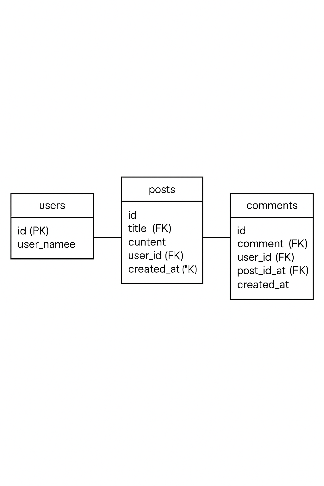

# Eestructura de carpeta
- **models**, continee los modelos que nos permitiran interactuar con la base de datos y tambien contiene la logica para el mandejo de datos
- **containers**, contiene los controladores que reciven las solicitudes de los usuario, lo que esta entre le usuario y los datos del modelo
- **views**, muestra el contenido al usuario, contiene los formularios mostrados al usuario

/prac7_JosueFLores
│
├── index.php                      ← Enrutador principal
├── proyecto.sql                   ← Archivo de la base de datos
├── readme.md                      ← Documentacion del proyecto 
│
├── /styles                        ← Frontend de la pagina(para usuarios)
│   ├── estilos.css                ← Contiene los estilos usados por los fomularios
│
├── /models                        ← Modelos PHP (acceso a datos y conneción a la db)
│   ├── Connection.php
│   └── Post.php
│   └── Comment.php
│
├── /controllers                   ← Controladores (lógica entre modelos y vistas)
│   ├── comment_index.php          ← Obtener y mostrar los Comments
│   ├── comment_store.php          ← Crear comentarios
│   ├── comment_delete.php         ← Elimina comentarios
│   ├── post_index.php             ← Obtiener y mostrar los Post
│   ├── post_create.php            ← Crear publicación
│   ├── post_delete.php            ← Listar publicaciones
│   └── post_edit.php              ← Guardar publicación  
│
├── /views                         ← Vistas (HTML con PHP)
│   ├── post_create_form.php       ← Formulario de creacion de publicaciones
│   ├── post_delete_form.php       ← Formulario de eliminacion de publicaciones
│   ├── post_edit_form.php         ← Formulario de edicion de publicaciones
│   ├── post_list.php              ← Mostrar lista de publicaciones
│   └── comment_list.php           ← Mostrar lista de los comentarios(incluye añadir comentarios y eliminar comentarios)

# Diagrama entidad-Relacion de la base de datos

# Preparacion de la aplicaion
1.- copiar la carpeta del proyecto
2.- copiar el archivo 'proyecto.sql' a HEIDISQL 
3.- en el archivo 'Connection.php' cambiar/borrar (si es necesario) la contraseña, poner el nombre de la base de datos, cambiar (si es necesario) el puerto
4.- al crear un nuevo post esta ingresando con id=1, toda publicaion que haga sera con el usuario Juan Perez
5.- para comentar si puede cambiar de id y puede escojer esntre los 3 id existentes
6.- la aplicaion le permite crear, editar y borrar los post asi como tambien puedes crear y borrar comentarios
 

